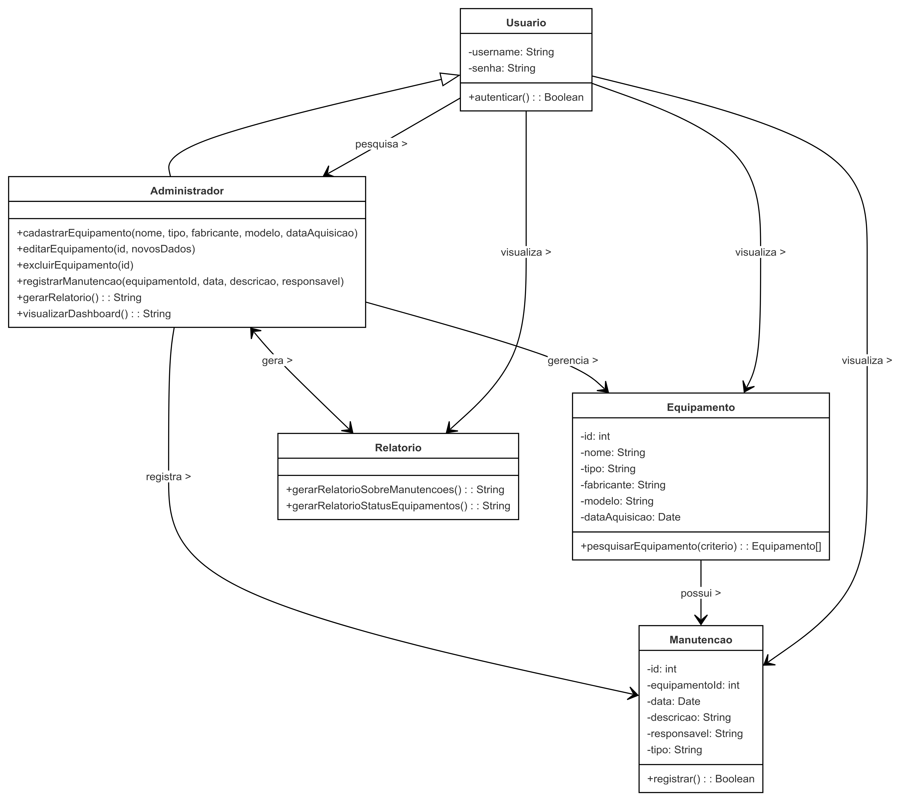
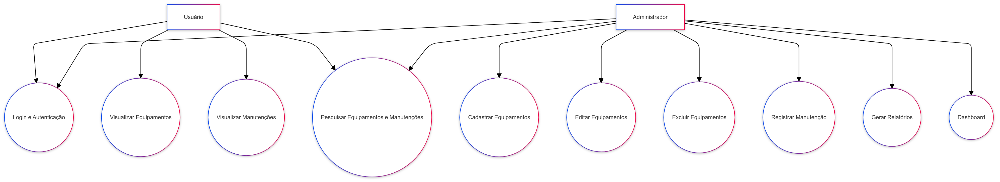
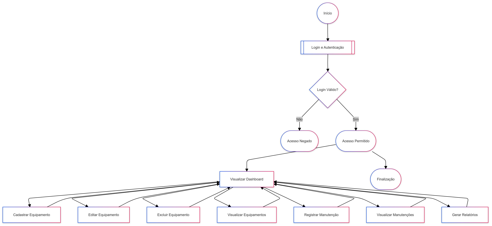

# Especificação de Requisitos do Sistema de Manutenção Preventiva e Corretiva

## 1. Introdução

Este documento descreve os requisitos do Sistema de Manutenção Preventiva e Corretiva. O objetivo é fornecer uma visão clara das funcionalidades e das necessidades do sistema, assegurando que todas as expectativas sejam atendidas.

## 2. Escopo do Sistema

O **Sistema de Manutenção Preventiva e Corretiva** é projetado para gerenciar a manutenção de equipamentos. As principais funcionalidades incluem o cadastro de equipamentos, registro de manutenções, geração de relatórios e um painel de controle para visualização das informações. O sistema visa melhorar a eficiência na gestão da manutenção e garantir a integridade dos equipamentos.

### 2.1. Objetivos do Sistema

- Facilitar o cadastro e gerenciamento de equipamentos.
- Registrar manutenções preventivas e corretivas.
- Gerar relatórios sobre as manutenções realizadas.
- Fornecer uma interface amigável para os usuários.

## 3. Funcionalidades do Sistema

### 3.1. Funcionalidades Principais

1. **Cadastro de Equipamentos**:
   - Permitir o registro de novos equipamentos, incluindo informações como nome, tipo, fabricante, modelo e data de aquisição.
  
2. **Edição de Equipamentos**:
   - Permitir a edição das informações de equipamentos já cadastrados.

3. **Exclusão de Equipamentos**:
   - Permitir a remoção de equipamentos do sistema.

4. **Registro de Manutenção**:
   - Permitir o registro de manutenções preventivas e corretivas, incluindo detalhes como data, descrição e responsável.

5. **Visualização de Equipamentos**:
   - Exibir a lista de todos os equipamentos cadastrados.

6. **Visualização de Manutenções**:
   - Exibir a lista de manutenções realizadas em cada equipamento.

7. **Geração de Relatórios**:
   - Permitir a geração de relatórios sobre manutenções realizadas e status dos equipamentos.

### 3.2. Funcionalidades Adicionais

- **Login e Autenticação**:
  - Controle de acesso ao sistema, permitindo apenas usuários autenticados.
  
- **Dashboard**:
  - Exibição de informações resumidas sobre o status dos equipamentos e manutenções pendentes.

## 4. Requisitos do Sistema

### 4.1. Requisitos Funcionais

- O sistema deve permitir que usuários se autentiquem com nome de usuário e senha.
- O sistema deve armazenar dados de equipamentos e manutenções em um banco de dados.
- O sistema deve garantir que apenas usuários autenticados possam acessar funcionalidades de cadastro, edição e exclusão.
- O sistema deve permitir a pesquisa de equipamentos e manutenções.

### 4.2. Requisitos Não Funcionais

- **Usabilidade**: A interface do usuário deve ser intuitiva e fácil de navegar.
- **Desempenho**: O sistema deve responder a comandos do usuário em até 2 segundos.
- **Segurança**: O sistema deve criptografar senhas e proteger dados sensíveis.
- **Compatibilidade**: O sistema deve ser compatível com os navegadores mais utilizados (Chrome, Firefox, Safari).

## 5. Validação dos Requisitos

Os requisitos serão validados através de testes funcionais e de usabilidade, garantindo que cada funcionalidade implementada atende às especificações definidas. Os testes incluirão casos de uso baseados nas funcionalidades descritas, além de testes de integração e desempenho.

## 6. Conclusão

Este documento de especificação de requisitos fornece uma base sólida para o desenvolvimento do Sistema de Manutenção Preventiva e Corretiva. As funcionalidades e requisitos descritos devem ser seguidos durante o desenvolvimento, garantindo que o produto final atenda às necessidades dos usuários.

---

# Diagramas 

## Diagrama de Classes


## Diagrama de Uso


## Diagrama de Fluxo


---

# Manual do Usuário do Sistema de Manutenção Preventiva e Corretiva

## 1. Introdução

O **Sistema de Manutenção Preventiva e Corretiva** é uma aplicação desenvolvida para gerenciar a manutenção de equipamentos, facilitando o cadastro, registro e geração de relatórios. Este manual fornece instruções sobre como instalar, utilizar e navegar pelo sistema.

## 2. Instalação e Execução do Sistema

### 2.1. Requisitos do Sistema

Antes de instalar o sistema, verifique se você possui os seguintes requisitos:

- Java Development Kit (JDK) instalado (versão 8 ou superior).
- Um servidor de banco de dados configurado (por exemplo, PostgreSQL).
- Um ambiente de desenvolvimento (IDE) como Eclipse, IntelliJ IDEA ou outro de sua escolha.

### 2.2. Passos para Instalação

1. **Clone o repositório do projeto**:
   ```bash
   git clone <URL-do-repositório>
   ```

2. **Abra o projeto na IDE**:
   - Abra a IDE escolhida e importe o projeto clonado.

3. **Configure o Banco de Dados**:
   - Execute o script SQL fornecido na pasta `database` para criar as tabelas necessárias no seu servidor de banco de dados.

4. **Ajuste as Configurações**:
   - Altere as configurações de conexão do banco de dados no arquivo de propriedades do projeto (`application.properties` ou equivalente).

5. **Compile e Execute o Projeto**:
   - Compile o projeto e execute a classe principal, normalmente chamada `Main` ou `App`.

### 2.3. Acesso ao Sistema

- Após executar a aplicação, abra um navegador da web e acesse `http://localhost:8080` (ou outra porta configurada) para acessar a interface do sistema.

## 3. Operações Principais

### 3.1. Cadastro de Equipamentos

1. No menu principal, clique em **"Cadastro"** e selecione **"Equipamentos"**.
2. Preencha os campos obrigatórios, como:
   - Nome do Equipamento
   - Tipo
   - Fabricante
   - Modelo
   - Data de Aquisição
3. Clique em **"Salvar"** para registrar o equipamento.

### 3.2. Registro de Manutenção

1. No menu, clique em **"Manutenção"** e selecione **"Registrar Manutenção"**.
2. Escolha o equipamento a ser mantido a partir da lista.
3. Insira os detalhes da manutenção:
   - Data da Manutenção
   - Descrição
   - Responsável
4. Clique em **"Salvar"** para registrar a manutenção.

### 3.3. Geração de Relatórios

1. No menu principal, clique em **"Relatórios"**.
2. Selecione o tipo de relatório que deseja gerar (por exemplo, **"Relatório de Manutenções"**).
3. Escolha o intervalo de datas e outros filtros, se aplicável.
4. Clique em **"Gerar Relatório"** e aguarde a geração do documento.

## 4. Fluxo Básico de Uso da Aplicação

1. **Login**: Acesse o sistema e faça o login com suas credenciais.
2. **Cadastro**: Adicione novos equipamentos conforme necessário.
3. **Registro**: Realize registros de manutenções para cada equipamento.
4. **Consulta**: Utilize a funcionalidade de consulta para visualizar equipamentos e suas manutenções.
5. **Relatórios**: Gere relatórios para análise das manutenções realizadas.
6. **Logout**: Ao finalizar, saia do sistema para garantir a segurança dos dados.

## 5. Navegação e Interface Gráfica

### 5.1. Menus e Botões

- **Menu Principal**: Localizado na parte superior da tela, permitindo acesso rápido às principais funcionalidades (Cadastro, Manutenção, Relatórios).
- **Botão "Salvar"**: Usado para registrar dados inseridos em formulários de cadastro ou manutenção.
- **Botão "Cancelar"**: Usado para descartar alterações e voltar à tela anterior.

### 5.2. Funcionalidades na Interface

- **Lista de Equipamentos**: Mostra todos os equipamentos cadastrados com opções para editar ou excluir.
- **Tela de Registro de Manutenção**: Permite registrar novas manutenções com campos para detalhes específicos.
- **Relatórios**: Apresenta uma visualização clara dos relatórios gerados e permite o download em formato PDF ou Excel.

## 6. Suporte

Se você encontrar problemas ou tiver dúvidas durante a utilização do sistema, consulte a seção de ajuda na interface ou entre em contato com o suporte técnico através do e-mail: suporte@sistemamanutencao.com.

## 7. Conclusão

Este manual fornece um guia abrangente sobre como instalar e usar o Sistema de Manutenção Preventiva e Corretiva. Aproveite ao máximo as funcionalidades oferecidas e mantenha seus equipamentos em ótimo estado.
